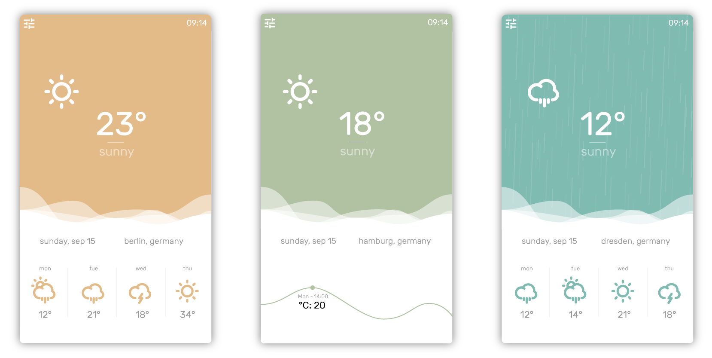

<h1 align="center">
<a href="https://github.com/jackd248/temps">
</a><br/><br/>
Temps
<br/>
<br/>
</h1>

<h4 align="center">A simple but smart weather app.</h4>
<h5 align="center"></h5>

<p align="center">
  <a href="https://github.com/jackd248/temps/releases"></a>
  <a href="https://github.com/jackd248/temps/releases"></a>
  <a href="https://david-dm.org/jackd248/temps" title="dependencies status"></a>
  <a href="https://travis-ci.org/jackd248/temps" title="build status"></a>
</p>

<strong>Notice</strong>
<p>
  The project isn't maintained anymore.
</p>
<p>
  Feel free to try one of the diligent forks:
</p>
<ul>
  <li><a href="https://github.com/musicpro/temps">musicpro/temps</a></li>
  <li><a href="https://github.com/GirkovArpa/temps-lite">GirkovArpa/temps-lite</a></li>
</ul>
<hr/>

> Temps is a modern and minimal menubar application based on Electron with actual weather information and forecast for Windows, Mac and Linux.


## Features

* Actual weather information for any location
* Four-Day weather forecast
* Interactive hourly weather graph
* Timezone support
* Information directly in your menubar available
* _Rain_, _snow_ and _thunder_ animation
* Shortcut support
* Minimal and colorful design

### Keyboard support

You can use the following shortcuts for easy usage of Temps:

* <kbd>Cmd</kbd> + <kbd>Shift</kbd> + <kbd>W</kbd> Global shortcut
* <kbd>Cmd</kbd> + <kbd>D</kbd> Switch details (four-day and hourly forecast)
* <kbd>Cmd</kbd> + <kbd>S</kbd> Open settings
* <kbd>Cmd</kbd> + <kbd>F</kbd> Search weather for your favorite city
* <kbd>Cmd</kbd> + <kbd>R</kbd> Reload application
* <kbd>Cmd</kbd> + <kbd>E</kbd> Reload weather data
* <kbd>Cmd</kbd> + <kbd>W</kbd> Search random city weather 
* <kbd>Cmd</kbd> + <kbd>G</kbd> Find your location
* <kbd>Cmd</kbd> + <kbd>Q</kbd> Close application



## Development

### Run app

1. Clone repo ```git clone https://github.com/jackd248/temps.git```
2. Change to repo ```cd temps```
3. ```npm install && npm start```

### Build

Builds app binaries for OS X, Linux, and Windows.

```npm run build```

[](https://github.com/feross/standard)

## Download []()

You can [download](https://github.com/jackd248/temps/releases) the latest stable version of Temps for Windows, Mac OS and Linux. 

### Instructions

__You need a free API Key by [OpenWeatherMap](http://openweathermap.org/) to fetch weather information.__

Because of this is a non-profit project, I'm not able to offer unlimited access to weather information by myself. 

For the start you can use the built-in key to get the weather data. But it can be possible with heavy data traffic, that the service isn't available for this key all the time. 

The apps are also not signed for now. So you need to grant usage by the system to run the app. 

## Credits

This application uses code from several open source projects:

* [Electron](http://electron.atom.io/)
* [Menubar](https://github.com/maxogden/menubar)
* [OpenWeatherMap](http://openweathermap.org/)
* [Chart.js](http://www.chartjs.org/)

The weather icons are made by myself. If you like to use them in your own project, you can find the icons on [Github](https://github.com/jackd248/weather-iconic) or [Noun Project](https://thenounproject.com/konradmichalik/collection/weather/).

## License []()

Copyright (c) 2016 Konrad Michalik, This software is licensed under the [MIT License](LICENSE).
