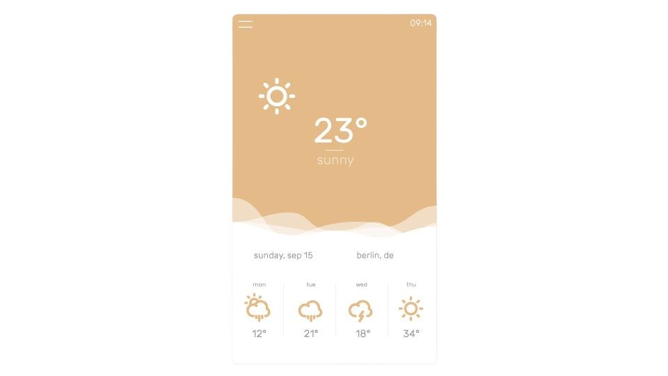

<h1 align="center">
<a href="https://github.com/jackd248/temps">
</a><br/><br/>
Temps
<br/>
<br/>
</h1>

<h4 align="center">Menubar weather app</h4>
<h5 align="center"></h5>

<p align="center">
  <a href="https://github.com/jackd248/temps/releases"></a>
</p>

Temps is a modern and minimal menubar application based on Electron with actual weather information and forecast for Windows, Mac and Linux.



## Features

* Actual weather information
* Daily forecast
* Hourly forecast graph
* Information directly in menubar

## Build

1. Clone repo ```git clone https://github.com/jackd248/temps.git```
2. Change to repo ```cd temps```
3. ```npm install && npm start```

## Download

You can [download](https://github.com/jackd248/temps/releases) the latest stable version of Temps for Windows, Mac OS and Linux. 

## Credits

This application uses code from several open source projects:

* [Electron](http://electron.atom.io/)
* [Menubar](https://github.com/maxogden/menubar)
* [OpenWeatherMap](http://openweathermap.org/)

## License

Copyright (c) 2016 Konrad Michalik, This software is licensed under the [MIT License](LICENSE).
